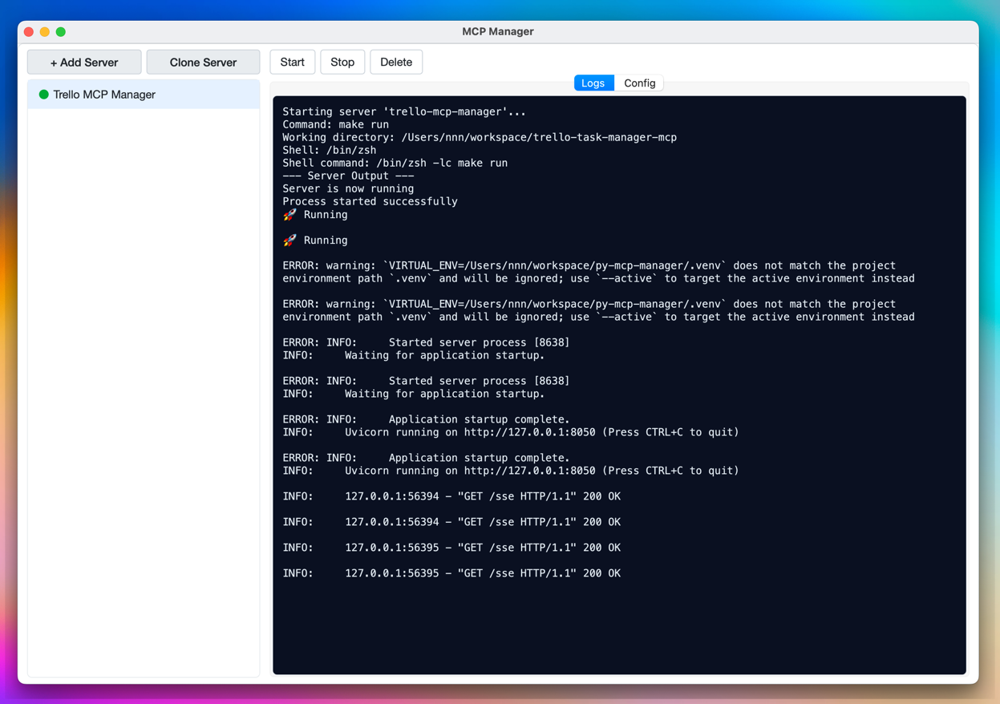

# MCP Manager

A desktop application for managing Model Context Protocol (MCP) servers with a graphical interface.



## Overview

MCP Manager simplifies the process of configuring, starting, stopping, and monitoring multiple MCP servers from a single interface.

## Installation

### Prerequisites

- Python 3.11 or higher
- [uv](https://github.com/astral-sh/uv) (recommended for dependency management)

### Using uv (recommended)

```bash
# Clone the repository
git clone https://github.com/your-username/mcp-manager.git
cd mcp-manager

# Install dependencies
make install

# Run the application
make run
```

To create a standalone executable:

```bash
# Create macOS .app bundle
make package

# Install to Applications folder
make install-macosx
```

## Usage

1. Launch the application using one of the methods above
2. Click "+ Add Server" to create your first server configuration
3. Fill in the server details:
   - Server ID (unique identifier)
   - Display Name
   - Command to run the server
   - Arguments
   - Environment variables
   - Working directory
4. Click "Save"
5. Use the "Start" button to launch your server
6. Monitor logs and status in real-time

## Configuration

Server configurations are stored in a platform-appropriate user data directory:

- **macOS**: `~/Library/Application Support/MCP Manager/mcp_servers.json`
- **Windows**: `%APPDATA%\MCP Manager\mcp_servers.json`
- **Linux**: `~/.local/share/mcp-manager/mcp_servers.json`

You can:

- Manually edit this file when the application is not running
- Use the built-in JSON editor (View JSON button)
- Import/export configurations using the JSON import/export features

## License

This project is licensed under the MIT License - see the LICENSE file for details.
